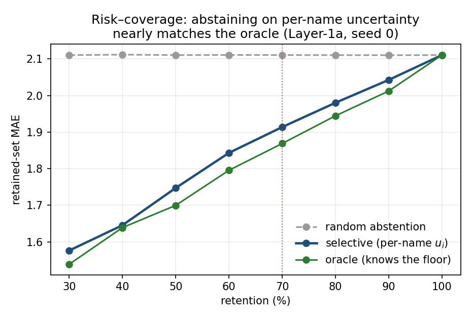
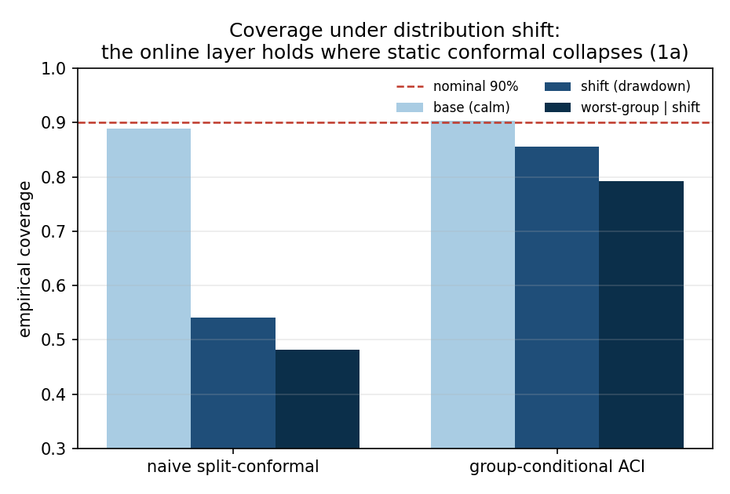
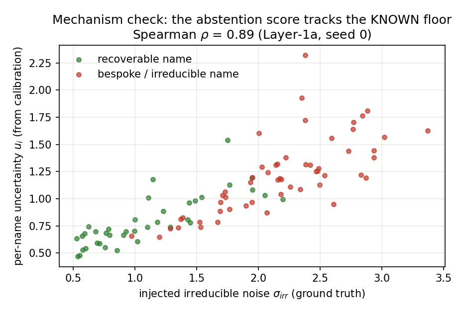

# conformal-selective-uq

**Selective conformal regression with conditional coverage under shift — validated against a
known irreducible-noise floor.** A portable uncertainty-quantification method, demonstrated on a
cross-sectional financial *allocation-reconstruction* task. Laptop-runnable end to end; no API key;
every reported number reproduces bit-for-bit from a seeded run.

---

## What this is (one paragraph)

Most conformal/selective-prediction work can tell you *that* a prediction interval has nominal
coverage, but not *whether the model abstains in the right place* — because real tasks have no
ground truth for "which points were ever recoverable." This project builds a task that **does**
have that ground truth (a known recoverable-vs-irreducible decomposition), and uses it to
**mechanism-validate** a selective conformal regressor that holds **group-conditional coverage
under documented distribution shift**. The demonstration domain is cross-sectional reconstruction
of a systematic manager's portfolio *weights* from public features — a regression with a real,
known irreducible-noise floor (~60% bespoke) rather than the crowded returns/ranking setting.

## 📄 Read the notes

**[`reports/p4_writeup.md`](reports/p4_writeup.md)** — the short methods note: the gap, the method,
the pre-registered gates and what they returned, the honest boundaries. Start there for the 5-minute
version.

**[`reports/p5_archival_note.md`](reports/p5_archival_note.md)** — the **archival-grade** note: the
single contribution sharpened in two parts — **(C1)** the mechanism-validated abstention test on the
known floor, and **(C2)** a **conditional-coverage tradeoff surface** (calibrated-vs-online /
union-vs-coupled / global-vs-group, and width-space-vs-alpha-space) whose one diagnosed design
tension is then resolved (§12), with extension sprints folded in (§13). Read this for the methods depth.

## Results at a glance (Layer-1a, the controlled known-floor experiment)

Pre-registered gates (frozen *before* the method ran), multi-seed {0,1,2}:

| Gate | Tests | Verdict |
|---|---|---|
| **G-PRIMARY (i)** useful abstention | retained-MAE beats random @70% | **PASS** (−0.178 ≥ Δ=0.119, ~75% of oracle headroom) |
| **G-PRIMARY (ii)** conditional coverage | per-group coverage on retained set | conditioned axes within τ; sector ~1pp over (qualified) |
| **G-SHIFT** shift-robust coverage | worst-group under the drawdown | **PASS** (ACI 0.507 → **0.815**) |
| **G-MECHANISM** right-place abstention | uncertainty vs the *known* floor | **PASS** (AUC 0.81, ρ 0.86, survives vol control) |
| **G-NULL** leakage guard | label-shuffle | **PASS** (advantage 0.178 → 0.002) |

| | | |
|:--:|:--:|:--:|
|  |  |  |
| abstention ≈ oracle, ≫ random | ACI holds where naive collapses | uncertainty tracks the **known** floor (ρ=0.89) |

**Layer 1b (real public forward returns):** G-SHIFT replicates (worst-group 0.734 → 0.858) — not a
synthetic artifact. The conditional-coverage lineage (P2.1 → P2.3, then P6/P7) maps a five-to-seven
method tradeoff surface and closes its one diagnosed design tension; the extension sprints (P8–P11)
add joint certification on the simplex, online risk control, a continuous-conditional comparator, and
an anytime-valid break monitor. Full detail in
**[`reports/p5_archival_note.md`](reports/p5_archival_note.md)**. **A real-data confirmation exists
in a separate private repository and is referenced by pointer only** — no private data, numbers, or
provenance enter this repo (the mechanism *validation* lives on the synthetic Layer 1a, where ground
truth exists). Figures regenerate via `python src/figures.py`.

## Folder map

| Path | What |
|---|---|
| `SPEC.md` | **The detailed plan** — motivation, the gap vs. literature, the pinned contribution, substrate design, pre-registered gates, method stack, phases, risks, references, extension sprints. Start here for the design. |
| `reports/` | Per-phase **pre-registration** (`*_preregistration.md`) + **results** (`*_results.md`), and the two synthesis notes (`p4_writeup.md`, `p5_archival_note.md`). Gate-first: pre-reg is frozen *before* the method runs. |
| `src/` | Code (panels → base learners → conformal layer → selective layer → eval; `figures.py` regenerates the figures). |
| `figures/` | The committed headline figures (risk–coverage, coverage-under-shift, mechanism). |
| `data/` | Gitignored. Public PIT feature panels + generated semi-synthetic targets (regenerated locally). |

## Conventions
- **Gate-first.** No experiment without a pre-registered ship/reject statistic (`reports/*_preregistration.md`).
- **Baselines before models.** Naive split-conformal and random abstention are computed first; the
  method must beat them on a pre-committed margin.
- **Multi-seed ≥3, no point estimate without a band.** Clustered/blocked resampling for inference.
- **Public-safe by construction.** No account, position, or holdings data enters this repo; the
  demonstration uses a transparent public universe and a self-built semi-synthetic allocator.

## Setup & reproduce
Python 3.11+. `pip install -r requirements.txt` (numpy, pandas, scikit-learn, lightgbm, scipy,
matplotlib; yfinance / pandas-datareader for the public panel). Laptop-runnable end to end — no
cluster, no API key required.

```
pip install -r requirements.txt
python src/run_p1.py      # baselines: marginal coverage holds; conditional fails under shift
python src/run_p2.py      # the four gates, multi-seed, on 1a + 1b
python src/figures.py     # the three headline figures
```

Each driver pairs with a frozen `reports/<phase>_preregistration.md` and a `reports/<phase>_results.md`;
every reported number reproduces bit-for-bit from the seeded run.

## License
MIT — see [`LICENSE`](LICENSE).

## How to cite
See [`CITATION.cff`](CITATION.cff). If you use this work, please cite the repository (a conference
reference will be added here if/when the accompanying extended abstract is published).
